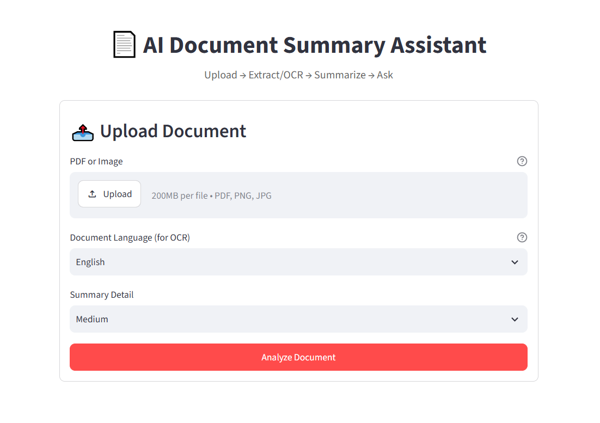

# Infera

**AI-Powered Document Summary Assistant** — upload a PDF or image (including
scanned documents, in multiple languages), generate summaries, key points, main ideas, improvement suggestions, and document-grounded Q&A using RAG.


🔗 **Live app:** https://inferagit-6kgh3se5gka3wubfvwepgk.streamlit.app/

---

## 1. Problem Statement

Reading and understanding long or scanned documents can be time-consuming.
Infera automates document extraction, summarization, and question answering
using OCR, semantic search, RAG, and LLMs.

## 2. Features

- 📤 Upload PDF, PNG, JPG, JPEG (drag-and-drop or file picker)
- 🔎 Dual-path text extraction: Direct PDF text layer extraction via PyMuPDF or Tesseract OCR fallback for scanned PDFs and raw images.
- 🌐 **Multilingual OCR** — Selectable per-document OCR engine for English, Hindi, Telugu, Tamil, Bengali, and English-paired combinations (hin+eng, tel+eng, tam+eng, ben+eng) to prevent cross-script character confusion.
- Page-Aware Processing:Text normalization, cleaning, and context-aware chunking preserving page-number metadata.
- 🧠 Semantic Vector Indexing: Sentence-Transformers embeddings (all-MiniLM-L6-v2) indexed inside a local FAISS vector store.
- 📝 Adaptive Summaries: Short, Medium, and Long detail levels utilizing map-reduce processing for large documents.
- 🔑 Structured Insights: Bulleted Key Points, Main Ideas (for recall), and actionable Improvement Suggestions.
- 💬 Grounded RAG Q&A: Interactive Q&A grounded strictly in the source document with exact page-number citations.
- ⬇️ Export Options: Downloadable summary reports in text format.
- 📱 Mobile-First UX: Responsive layout, stacked control inputs, collapsible full-text view, clear loading states, and custom CSS breakpoints.
- Clean error handling and visible pipeline loading states


## 🖥️ Infera in Action



## 3. Architecture

```
Document (PDF/Image)
        │
        ▼
 Extract / OCR   (PyMuPDF text layer, or Tesseract OCR fallback)
        │
        ▼
 Clean & Chunk    (page-aware chunking, LangChain text splitter)
        │
        ▼
 Embed            (Sentence-Transformers all-MiniLM-L6-v2)
        │
        ▼
 FAISS Vector Store
        │
   ┌────┴─────┐
   ▼          ▼
Summary /   RAG Retrieval (question → top-k relevant chunks)
Key Points /      │
Main Ideas /      ▼
Suggestions    Groq LLM → Grounded Answer + Page Sources
   │
   ▼
Streamlit UI
```

## 4. Tech Stack

| Layer            | Technology                              |
|-------------------|------------------------------------------|
| Frontend/UI       | Streamlit                                |
| PDF Parsing       | PyMuPDF (fitz)                           |
| OCR               | Tesseract + pytesseract                  |
| Text Chunking     | LangChain Text Splitters                 |
| Embeddings        | Sentence-Transformers (all-MiniLM-L6-v2) |
| Vector Database   | FAISS                                    |
| LLM               | Groq API                                 |
| Deployment        | Streamlit Community Cloud                |

## 5. RAG Workflow

**Indexing:**  
Document → Extract → Chunk → Embed → FAISS

**Retrieval:**  
Question → Similarity Search → Relevant Chunks → Groq LLM → Grounded Answer

## 6. Language Support (Multilingual OCR)

For scanned documents and images, users select the document language so
Tesseract uses the appropriate trained language model.

| Language | Code | Language | Code |
|---|---|---|---|
| English | `eng` | Hindi + English | `hin+eng` |
| Hindi | `hin` | Telugu + English | `tel+eng` |
| Telugu | `tel` | Tamil + English | `tam+eng` |
| Tamil | `tam` | Bengali + English | `ben+eng` |
| Bengali | `ben` | | |

Digitally generated PDFs bypass OCR completely as text is parsed directly via PyMuPDF.


## 7. Installation (Local)

**Prerequisites:** Python 3.10+ and the Tesseract OCR engine installed at the
system level 

- **macOS:** `brew install tesseract tesseract-lang`
- **Ubuntu/Debian:**
  ```bash
  sudo apt-get install tesseract-ocr \
    tesseract-ocr-eng tesseract-ocr-hin tesseract-ocr-tel \
    tesseract-ocr-tam tesseract-ocr-ben
  ```
- **Windows:** install from https://github.com/UB-Mannheim/tesseract/wiki

Repository Setup

```bash
git clone <your-repo-url>
cd Infera
python -m venv venv
source venv/bin/activate        # Windows: venv\Scripts\activate
pip install -r requirements.txt
```

## 8. Environment Setup

1. Copy `.env.example` to `.env`:
   
   ```bash
   cp .env.example .env
   ```
   
2. Open `.env` and set your real Groq API key
   
   ```
   GROQ_API_KEY=gsk_your_real_key_here
   ```

## 9. Usage (Local)

```bash
streamlit run app.py
```

Then open the URL Streamlit prints (usually `http://localhost:8501`), upload
a PDF or image, pick a summary detail level and document language, and click
**Analyze Document**.

## 10. Deployment (Streamlit Community Cloud)

1. Push this project to a **public GitHub repository**.
2. Create a **New app** at share.streamlit.io.
3. Connect your repository and set the main file path to app.py
4. In Settings → Secrets, paste your production keys in TOML format:
   
   ```toml
   GROQ_API_KEY = "gsk_your_real_key_here"
   GROQ_MODEL = "openai/gpt-oss-120b"
   EMBEDDING_MODEL_NAME = "sentence-transformers/all-MiniLM-L6-v2"
   ```
5. Deploy.

## 11. Limitations

- Session Scope: Operates on single-document sessions without multi-document cross-referencing.
- Scan Dependability: OCR accuracy is contingent on source image quality and clarity.
- Manual Language Selection: Requires selecting the target script manually for OCR processing.
- Layout Parsing: Extracts running text and page continuity; does not reconstruct visual layout matrices, complex columns, or tables.

## 12. Future Improvements

- Multi-document knowledge bases with cross-document Q&A
- Persistent chat history per document
- Support for DOCX and TXT uploads
- Streaming LLM responses in the UI
- Automated language identification for incoming scanned pages.

## 13. Summary

Infera ingests a PDF or image and extracts its text using PyMuPDF for
digital PDFs or Tesseract OCR for scanned pages, automatically detecting
which path each page needs. OCR runs against a user-selected language
(English, Hindi, Telugu, Tamil, Bengali, or an English-paired combination)
so Tesseract loads only the relevant model instead of guessing across
scripts. Extracted text is cleaned, normalized, and split into overlapping
chunks while preserving page numbers, then converted into semantic
embeddings via Sentence-Transformers and indexed in FAISS. For
summarization, the app sends the full document (or, for large documents, a
map-reduce hierarchy of section summaries) to a Groq-hosted LLM, instructed
to scale summary length to the content's actual length rather than a fixed
word count. The same call pattern produces bullet-point key points, concise
topic-heading main ideas for recall, and structured improvement suggestions.
For Q&A, user questions are embedded and matched against the FAISS index to
retrieve relevant chunks, passed to the LLM as grounding context so answers
cite specific pages instead of hallucinating. The pipeline runs inside one
mobile-responsive Streamlit app with clear loading states and error
handling, deploying unchanged to Streamlit Community Cloud via
`requirements.txt`, `packages.txt`, and Secrets.
